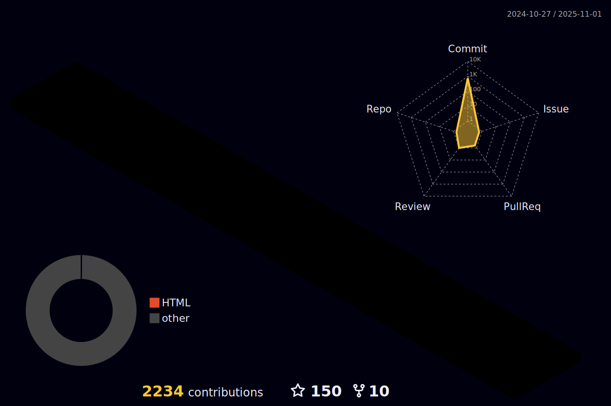

<h1 align="center">Hi there 👋 , I'm <a href="">Ritek</a> !</h1>
<h3 align="center">A Passionate Developer from India</h3>

 

- 🔭 I’m currently working at <a href="https://harness.io">Harness</a>
- 🌱 I’m currently learning React.
- 👯 I’m looking to collaborate with other Open Source Developers.
- 🥅 2023 Goals: Contribute to Open Source Projects.
- ⚡ Fun fact: I love to draw and play football.

 

<!--<h3 align="left">Languages and Tools:</h3>

                                             
-->
<h2 align="left">Skills : </h2>
<h3 align="left">Programming Languages :</h3>

         

<h3 align="left">Frontend Development :</h3>

          

<h3 align="left">Backend Development :</h3>

     

<h3 align="left">Database :</h3>

         

<h3 align="left">Mobile App Development :</h3>

     

<h3 align="left">Data Visualization :</h3>

   

<h3 align="left">DevOps :</h3>

        

<h3 align="left">Backend as a Service (Serverless):</h3>

    

<h3 align="left">Frameworks :</h3>

      

<h3 align="left">Testing :</h3>

   

<h3 align="left">Software :</h3>

        

<h3 align="left">Others :</h3>

    

 
<h4>GitHub Stats :<h4>

  
  

 
 

  
<h4>Watch my contribution graph get eaten by the snake 🐍</h4>

 

 

